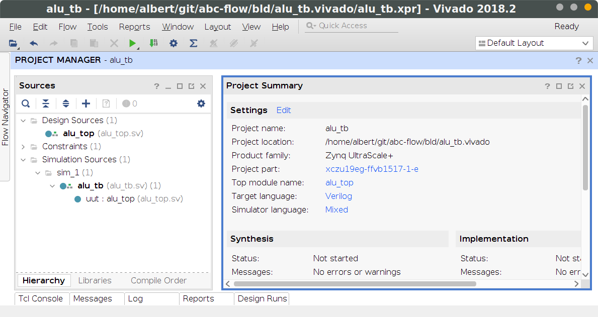

# The ABC-Flow. Text-based dependency files for FPGA projects.

A small `.abc` file describes a module's dependencies (sources,
sub-modules, packages, constraints, IPs); the `abc` launcher resolves
those dependencies and hands them to a chosen backend:

- **Vivado** — generate and open a `.xpr` project (`-gui`), or run
  headless: `-sim` for simulation, `-synth`/`-impl`/`-bitgen` for the
  implementation flow. The default backend.
- **XSim** *(experimental)* — direct headless `xvlog`/`xelab`/`xsim`
  for `-sim`, bypassing project startup. Falls back to Vivado for tasks
  using IP or project-flow commands.
- **Verilator** *(experimental)* — Vivado-free `verilator --binary`
  for `-sim`. Useful for CI runners and developers without a Vivado
  licence.

All three backends consume the same `.abc` files via the same Tcl-based
collector — the choice of backend is independent of how you describe
your project.

## Quickstart

Already have a Vivado project? You don't need to recreate it — just drop a small `.abc` next to each SystemVerilog source you want `abc` to know about, then point `abc` at the testbench (or the synth top).

### 1. Install

Pick **one** of the paths below; both leave `abc` on your `PATH`.

**Release tarball** — no `git` required:

```bash
# Linux / macOS — replace v0.1.0 with the latest tag from the Releases page
curl -fsSL https://github.com/accemic/abc-flow/releases/download/v0.1.0/abc-flow-v0.1.0.tar.gz \
  | tar xz -C ~/.local/share
echo 'export PATH="$HOME/.local/share/abc-flow/abc:$PATH"' >> ~/.bashrc
source ~/.bashrc
```

Windows: grab the `.zip` from the same release, extract anywhere, add the extracted `abc\` folder to your `PATH`.

**Git clone** — best if you want to follow `master`:

```bash
git clone https://github.com/accemic/abc-flow.git ~/abc-flow
echo 'export PATH="$HOME/abc-flow/abc:$PATH"' >> ~/.bashrc
source ~/.bashrc
```

Confirm with `abc -h`. (See [More on installation](#more-on-installation) for the symlink layout and a Windows step-by-step.)

### 2. Describe each module

For each source `foo.sv`, write a sibling `foo.abc` declaring its source and anything it instantiates or imports:

```tcl
# foo/foo.abc
import ../core/cross_reset                  # an instantiated submodule
import ../packages : wb_package math_pkg    # packages this module uses
read_sv foo.sv
```

Paths are relative to the `.abc` file's directory. The `:` token after a path uses it as a shared prefix for the rest of the list (the line above expands to `../packages/wb_package` + `../packages/math_pkg`). A leading `@` anchors at your git repo root.

### 3. Describe a testbench

Under each `test/` directory, a `.abc` brings in the design and triggers a sim:

```tcl
# foo/test/foo_tb.abc
import   ../foo           # the DUT (with all its dependencies)
read_sim foo_tb.sv        # the testbench source
simulate foo_tb           # the sim hierarchy top
```

### 4. (Optional) Implementation top

For a buildable top, scope board constraints with `-top` and trigger synthesis with `build`:

```tcl
# projects/myproj.abc
constraints -top impl ../boards/myboard/myboard.xdc
import @modules/myip/core : myip_core
read_sv  myproj_top.sv
build    myproj_top
```

### 5. Run it

```bash
abc -sim    foo/test/foo_tb.abc            # headless Vivado sim
abc -gui    foo/test/foo_tb.abc            # open the project in Vivado
abc -synth  projects/myproj.abc            # synth-up
abc -bitgen projects/myproj.abc            # all the way to a bitstream

# Pick a different sim backend any time:
abc --sim-backend xsim      -sim foo/test/foo_tb.abc   # direct XSim
abc --sim-backend verilator -sim foo/test/foo_tb.abc   # Verilator (no Vivado needed)
```

The [Example](#example) below shows a complete ALU + testbench using the same pattern. The full `.abc` command reference lives in [`doc/abc.md`](doc/abc.md).

## Example

The ALU implementation, referenced in `alu_top.abc`:
```
read_sv alu_top.sv
```

The testbench `alu_tb.abc` brings in the implementation as a dependency:
```
import    alu_top
read_sim  alu_tb.sv
simulate  alu_tb
```

Generate and open the Vivado project (`.xpr`):

`$ abc -gui alu_tb.abc`



Or run the testbench headless under any of the backends:

```bash
$ abc -sim alu_tb.abc                          # Vivado (default)
$ abc --sim-backend xsim -sim alu_tb.abc       # direct XSim
$ abc --sim-backend verilator -sim alu_tb.abc  # Verilator (no Vivado needed)
```

Set a project-wide default in `.abc.config` (see below) to avoid passing
`--sim-backend` every time.

```less
...
A: 23, B: 12, op: 001, result: 29
A: 56, B: 3c, op: 011, result: a0
A: e3, B: b1, op: 101, result: 5d
A: 52, B: a8, op: 111, result: 80
$finish called at time : 80 ns : File "example/alu_tb.sv" Line 66
```

## Features

- Text-based, dependency-driven `.abc` build files
- `import` between `.abc` files; `@`-anchored paths relative to the repo root
- Multiple backends behind one CLI: Vivado projects, headless XSim, Verilator
- Automated Vivado project generation; headless synth / impl / bitgen
- Hierarchical XDC support
- High flexibility since `.tcl` based
- IP-core support / interop (Vivado / XSim paths)

A detailed documentation can be found [here](doc/abc.md).

## Prerequisites

- Python 3 (required by the `abc` launcher)
- Git (.abc files must live in a git repository to enable root-anchored imports — may change in the future)
- **At least one backend** depending on what you want to run:
  - Vivado / XSim flows: Vivado in `$PATH` (or discoverable via default install paths / `ABC_VIVADO_ROOTS`).
  - Verilator flow: `verilator` (>= 4.220) in `$PATH`. Vivado is not required.

## More on installation

The [Quickstart](#quickstart) covers the common case (release tarball or one-line clone). This section adds the symlink layout, the Windows step-by-step, and the update flow.

### Recommended (Linux + Windows): clone and add `abc/` to PATH

This approach makes updates easy (`git pull`) and ensures `abc` and `abc.tcl` stay next to each other.

1) Clone the repo somewhere permanent (example):

```bash
git clone https://github.com/accemic/abc-flow.git ~/git/abc-flow
```

2) Add the repo’s `abc/` directory to your `PATH`.

- **Linux** (bash/zsh):

```bash
echo 'export PATH="$HOME/git/abc-flow/abc:$PATH"' >> ~/.bashrc
source ~/.bashrc
```

- **Windows** (PowerShell / cmd):
  - Open **System Properties → Environment Variables…**
  - Under **User variables**, select **Path** → **Edit** → **New**
  - Add: `C:\path\to\abc-flow\abc`
  - Open a **new** terminal and run `abc -h` to verify.
    - On Windows this is provided by `abc.cmd` (a wrapper that calls the Python launcher).

### Alternative (Linux): create symlinks into a PATH directory

If you don’t want to add the repo directory itself to PATH, you can symlink.

Important: **`abc` and `abc.tcl` must remain adjacent** (the launcher expects `abc.tcl` next to itself).

Example using `~/.local/bin`:

```bash
mkdir -p ~/.local/bin
ln -sf "$HOME/git/abc-flow/abc/abc"     ~/.local/bin/abc
ln -sf "$HOME/git/abc-flow/abc/abc.tcl" ~/.local/bin/abc.tcl

# ensure ~/.local/bin is on PATH
echo 'export PATH="$HOME/.local/bin:$PATH"' >> ~/.bashrc
source ~/.bashrc
```

### Update

From inside your clone directory (Linux/Windows):

```bash
cd <path-to-your-clone>
git pull
```

### Optional: project-local defaults

Create a `.abc.config` file in your git repo root:

```ini
vivado_sim=2024.1
vivado_impl=2024.1

# Optional additional install roots (same semantics as ABC_VIVADO_ROOTS)
vivado_roots=/opt/Xilinx/Vivado:/tools/Xilinx/Vivado

# Optional default simulation backend (vivado | xsim | verilator).
# An explicit --sim-backend on the command line overrides this. The
# xsim/verilator default applies only to -sim runs; -synth/-impl/
# -bitgen/-gui always use Vivado.
sim_backend=vivado
```

To add machine-local search roots without modifying the repo, set:

```bash
export ABC_VIVADO_ROOTS=/opt/Xilinx/Vivado:/tools/Xilinx/Vivado
```

The launcher prints a one-line message (to stderr) indicating which Vivado was selected and why.
Set `ABC_QUIET=1` to suppress this.

### Forcing a specific Vivado version

You can override all defaults/configuration with:

```bash
abc --vivado-version 2024.1 -gui myproj.abc
```

This is particularly useful when the invocation does not clearly indicate whether you want the
simulation or implementation Vivado version (e.g. `-gui` only).

### Passing selected Vivado flags through `abc`

Some CI setups historically call Vivado directly with flags like `-log`/`-notrace`/`-nojournal`.
The `abc` launcher supports passing these through to Vivado:

```bash
abc -notrace -nojournal -log run_ci.runs.log -new -sim ..
```

### Optional: colored / filtered Vivado output

When `abc` runs in an interactive terminal, it will colorize common Vivado log
lines (ERROR/WARNING/INFO/...) and suppress a small set of known-noisy messages.

You can control this behavior via environment variables:

- `ABC_NO_COLOR=1` (or `NO_COLOR`): disable ANSI colors
- `ABC_COLOR=1`: force colors even if stdout is not a TTY
- `ABC_FILTER=0/1`: disable/enable output filtering (skipping known-noisy lines)

## Author

Accemic Technologies GmbH: https://www.accemic.com - Thomas Preußer, Albert Schulz

## License

MIT License

Copyright (c) 2023-2026 Accemic Technologies GmbH

Permission is hereby granted, free of charge, to any person obtaining a copy
of this software and associated documentation files (the "Software"), to deal
in the Software without restriction, including without limitation the rights
to use, copy, modify, merge, publish, distribute, sublicense, and/or sell
copies of the Software, and to permit persons to whom the Software is
furnished to do so, subject to the following conditions:

The above copyright notice and this permission notice shall be included in all
copies or substantial portions of the Software.

THE SOFTWARE IS PROVIDED "AS IS", WITHOUT WARRANTY OF ANY KIND, EXPRESS OR
IMPLIED, INCLUDING BUT NOT LIMITED TO THE WARRANTIES OF MERCHANTABILITY,
FITNESS FOR A PARTICULAR PURPOSE AND NONINFRINGEMENT. IN NO EVENT SHALL THE
AUTHORS OR COPYRIGHT HOLDERS BE LIABLE FOR ANY CLAIM, DAMAGES OR OTHER
LIABILITY, WHETHER IN AN ACTION OF CONTRACT, TORT OR OTHERWISE, ARISING FROM,
OUT OF OR IN CONNECTION WITH THE SOFTWARE OR THE USE OR OTHER DEALINGS IN THE
SOFTWARE.
